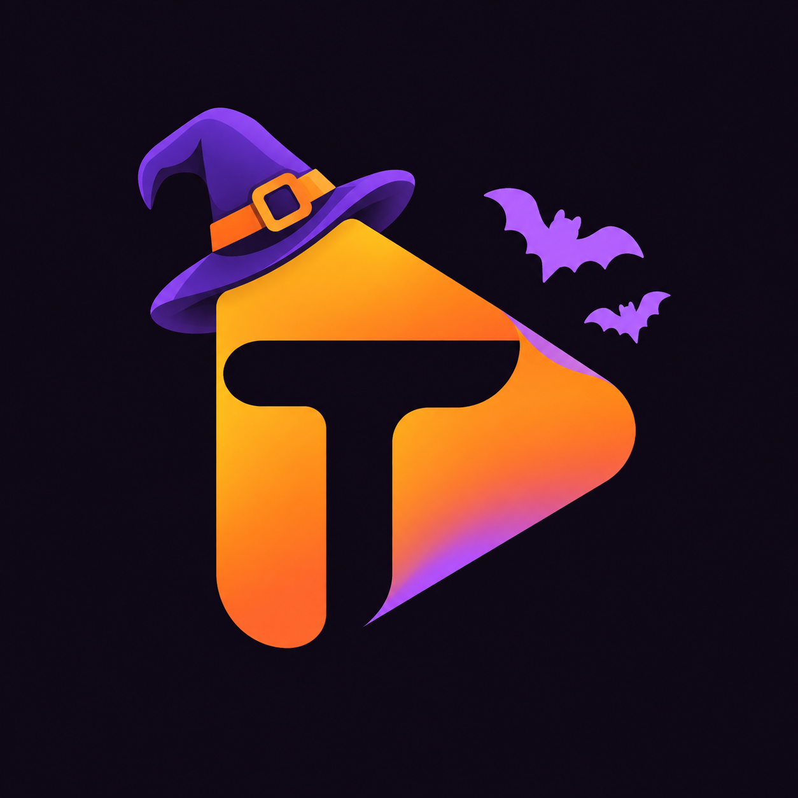
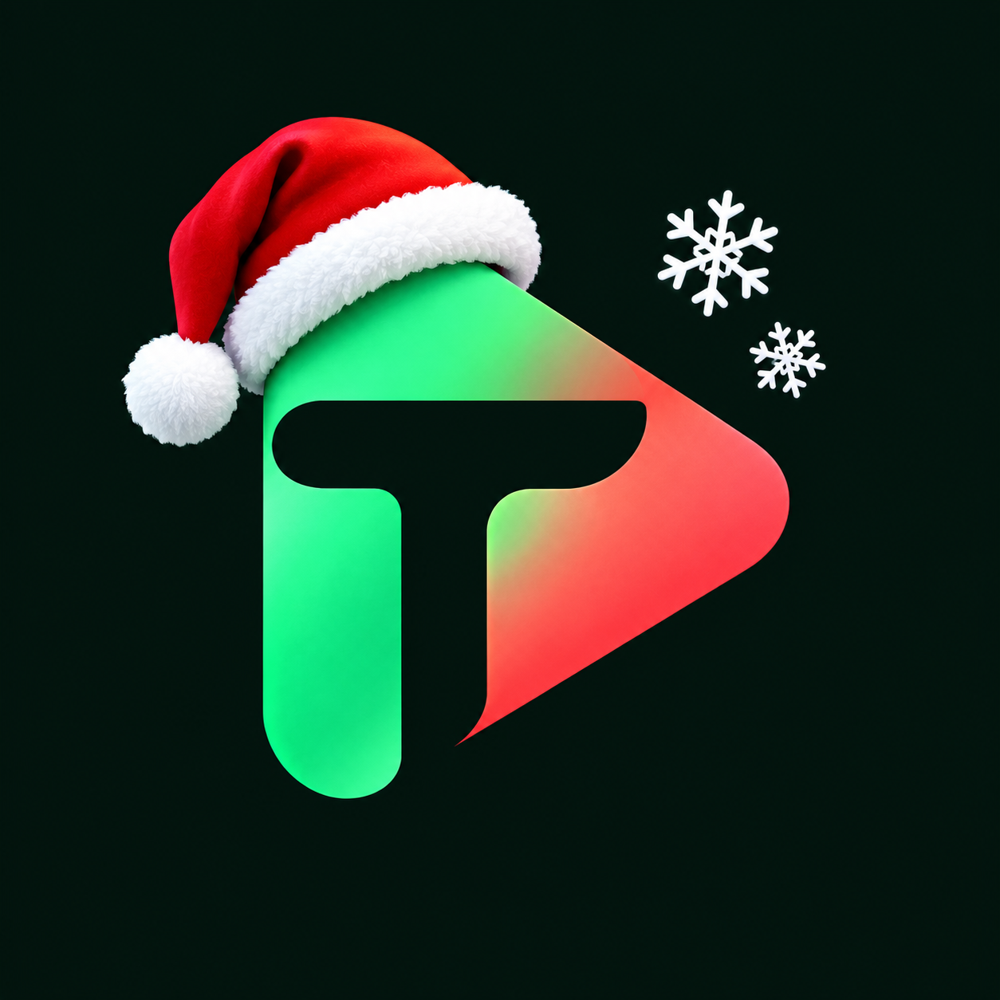

# Tikitoki · Videos verticales con Flutter

<p align="center">
  <strong>Desliza. Reproduce. Explora.</strong><br>
  Videos verticales · Flutter · Provider · Material 3
</p>

<p align="center">
  <a href="https://fariasdgs.github.io/Practicas_DMI_230389/practica04/">
    
  </a>
</p>

<p align="center">
  <a href="#capturas-de-la-aplicación">Ver capturas</a> ·
  <a href="#funcionalidades-actuales">Funcionalidades</a> ·
  <a href="#instalación-y-ejecución">Ejecutar la app</a>
</p>

<p align="center">
  
  
  
</p>

Proyecto de la **Práctica 04: Tikitoki App**, desarrollado por **Al Farias Leyva · 230389** para la asignatura **Desarrollo Móvil Integral**.

## Modelo interactivo del proyecto

El modelo presenta el recorrido del catálogo local hasta la reproducción del video: inicio de la app, administración del estado, conversión de datos, feed vertical y composición de la interfaz. Tiene una presentación minimalista con tarjetas, conexiones claras, temas claro y oscuro, zoom, búsqueda y exportación.

- [Abrir el HTML local en el navegador](../../docs/practica04/index.html).
- [Consultar la especificación editable](docs/archify/tikitoki.architecture.json).
- [Guía y comprobación del modelo](docs/archify/README.md).

**Publicación:** el enlace de GitHub Pages corresponde a `docs/practica04/index.html`. Estará disponible cuando estos archivos lleguen a la rama que publica Pages; crear el archivo local no publica el sitio.

El contenido del modelo está en español. Los controles del visor y el atributo de idioma del HTML usan inglés por las opciones disponibles en Archify.

## Identidad visual

La app utiliza un estilo **tech minimalista**, con un logo que combina una **T** y el símbolo de reproducción. La fuente **Montserrat** está incluida localmente y los acentos cian y violeta destacan los indicadores sobre el video.

| Elemento | Diseño |
| --- | --- |
| Fondo | Negro `#09090F` |
| Color principal | Cian `#22D3EE` |
| Color secundario | Violeta `#A78BFA` |
| Texto sobre el video | Blanco con sombra para mantener la legibilidad |
| Tipografía | Montserrat |

El [logo original](assets/icon/app_icon.png) se creó con ImageGen; el [prompt](assets/icon/prompt.txt) documenta su diseño. La [licencia de Montserrat](assets/fonts/OFL.txt) se conserva junto a la fuente.

Para regenerar los íconos desde la carpeta de la app:

```bash
dart run flutter_launcher_icons
```

La configuración está en [flutter_launcher_icons.yaml](flutter_launcher_icons.yaml). Para ver el nuevo ícono en el dispositivo, detén y vuelve a ejecutar la app; hot reload no reemplaza los íconos nativos. Si el sistema conserva el anterior, reinstala la app.

## Capturas de la aplicación

Estas capturas corresponden a la apariencia anterior al cambio de logo, fuente y colores.

Evidencias de Tikitoki ejecutándose en el **simulador iPhone 17 Pro con iOS 26.5**. Las imágenes muestran distintos videos del feed, las descripciones, el gradiente y los indicadores de likes y visualizaciones.

<table>
  <tr><th align="center">Feed vertical</th><th align="center">Gradiente y descripción</th><th align="center">Contenido del catálogo</th></tr>
  <tr>
    <td align="center" valign="top">
      <br>
      <sub>Escaleras automáticas, descripción e indicadores laterales.</sub>
    </td>
    <td align="center" valign="top">
      <br>
      <sub>Paisaje con sombreado inferior para leer el texto.</sub>
    </td>
    <td align="center" valign="top">
      <br>
      <sub>Supra con cifras abreviadas de un millón.</sub>
    </td>
  </tr>
</table>

<table>
  <tr><th align="center">Videos agregados</th><th align="center">Más variedad</th></tr>
  <tr>
    <td align="center" valign="top">
      <br>
      <sub>Perringo Cantando con indicadores de 6.7M.</sub>
    </td>
    <td align="center" valign="top">
      <br>
      <sub>R35 GTR con likes y vistas en formato compacto.</sub>
    </td>
  </tr>
</table>

Las cifras son datos del catálogo local. Las capturas documentan la interfaz; el sonido y los gestos de pausa o desplazamiento se comprueban al ejecutar la app.

## Descripción

Tikitoki es una aplicación de reproducción de videos verticales inspirada en la navegación de TikTok. El usuario desliza hacia arriba o abajo para cambiar de video y toca la imagen para pausar o reanudar la reproducción.

La app utiliza **14 videos locales** incluidos como recursos, un tema oscuro con Material 3, descripciones sobre el video y una columna de indicadores de likes y visualizaciones. Un gradiente inferior mejora la lectura del texto.

Esta etapa desarrolla el trabajo del curso de Udemy mencionado en los videos **99, 100 y 101**, con una organización en presentación, dominio, infraestructura y datos compartidos.

## Objetivo

Construir una aplicación con Flutter y Dart que permita reproducir recursos multimedia, administrar un catálogo con Provider y crear una interfaz de navegación vertical con componentes reutilizables.

### Objetivos específicos

- Administrar el estado mediante `ChangeNotifier` y `Provider`.
- Convertir registros locales en entidades `VideoPost`.
- Construir un feed con `PageView.builder` y desplazamiento vertical.
- Inicializar y liberar un `VideoPlayerController` por reproductor.
- Manejar la carga asíncrona con `FutureBuilder` y presentar fallos de inicialización.
- Superponer descripciones, gradientes e indicadores sobre el video.
- Abreviar cantidades con `intl` y animar un ícono con `animate_do`.

## Tematización automática y validación de videos

La app usa la **fecha local del dispositivo** para elegir su apariencia. Mantiene Montserrat y texto blanco para conservar la legibilidad sobre los videos.

| Fecha | Tema | Apariencia |
| --- | --- | --- |
| 1–31 de octubre | Halloween | Fondo oscuro, naranja y morado; distintivo Halloween |
| 1–31 de diciembre | Navidad | Fondo verde oscuro, verde y rojo; distintivo Navidad |
| Resto del año | Tech | Negro, cian y violeta |

El tema se revisa al iniciar, al regresar a la app y al llegar a medianoche. No requiere conexión a internet. El distintivo aparece sobre el feed durante las temporadas.

### Regla para cargar videos

`DiscoverProvider` filtra las entidades **antes de entregarlas a la pantalla**, de modo que un video rechazado no crea un controlador ni abre su archivo MP4.

| Condición | Resultado |
| --- | --- |
| `views < likes` | No aparece ni se carga el video |
| `views == likes` | Se permite |
| `views > likes` | Se permite |

El catálogo actual contiene **14 registros**, de los cuales **11 son válidos**. Los videos `1.mp4`, `2.mp4` y `3.mp4` quedan fuera porque sus vistas son menores que sus likes. Los archivos originales se conservan. Si ningún registro pasa el filtro, la app muestra un aviso en lugar de un feed vacío.

### Comprobación

```bash
flutter analyze
flutter test
```

Las pruebas cubren los límites de octubre y diciembre, los cambios de paleta, la igualdad de cifras, el rechazo de videos inválidos y el aviso cuando todos los videos se descartan. Para comprobar la apariencia en el emulador, usa una fecha de octubre, diciembre u otro mes y vuelve a abrir la app.

## Funcionalidades actuales

| Función | Comportamiento |
| --- | --- |
| Catálogo local | Lee 14 registros; actualmente muestra los 11 que pasan la validación |
| Validación de cifras | Excluye videos con menos vistas que likes antes de crear el reproductor |
| Tema por fecha | Halloween en octubre, Navidad en diciembre y tech el resto del año |
| Navegación vertical | Permite cambiar de video mediante gestos de desplazamiento |
| Reproducción automática | Inicia después de completar la inicialización |
| Pausa y reproducción | Tocar el video alterna entre ambos estados |
| Bucle y volumen | Repite el video con sonido activado |
| Video activo | Pausa las páginas fuera de pantalla al cambiar de video |
| Estado de carga | Muestra un indicador mientras se prepara el video |
| Error de carga | Presenta el error si falla la inicialización |
| Descripción | Muestra hasta dos líneas de texto sobre el video |
| Gradiente | Oscurece la parte inferior de arriba hacia abajo |
| Métricas | Presenta likes y vistas con cantidades abreviadas |
| Animación | Hace girar continuamente el ícono de reproducción lateral |

Los botones laterales son visuales: sus acciones están vacías y las cifras provienen del catálogo. No incrementan likes ni registran visualizaciones. El estado se conserva en memoria; esta versión no incluye una API, cuentas ni una base de datos.

## Flujo de funcionamiento

1. `MyApp` configura `MultiProvider`, el tema y `DiscoverScreen`.
2. Crea `DiscoverProvider` con `lazy: false` e invoca `loadNextPage()`.
3. El provider convierte cada registro mediante `LocalVideoModel.fromJson()` y `toVideoPostEntity()`, y conserva únicamente los que cumplen `views >= likes`.
4. Agrega las entidades a `videos`, desactiva `initialLoading` y llama a `notifyListeners()`.
5. `DiscoverScreen` observa el estado con `context.watch` y muestra `VideoScrollableView`.
6. `PageView.builder` construye páginas verticales con el reproductor y los indicadores.
7. `FullScreenPlayer` inicializa una sola vez el controlador, configura volumen y bucle, y reproduce el recurso MP4.
8. `VideoPlayer`, `VideoBackground` y la descripción forman la imagen final. Al retirar el reproductor, `dispose()` libera el controlador.

## Organización del proyecto

```text
Practica04/tikitoki/
├── lib/
│   ├── main.dart
│   ├── config/
│   │   ├── helpers/human_formats.dart
│   │   └── theme/app_theme.dart
│   ├── domain/entities/video_post.dart
│   ├── infraestructure/models/local_video_model.dart
│   ├── shared/data/local_video_post.dart
│   └── presentation/
│       ├── providers/discover_provider.dart
│       ├── screen/discover/discover_screen.dart
│       └── widgets/
│           ├── shared/                 # Feed e indicadores
│           └── video/                  # Reproductor y gradiente
├── assets/
│   ├── videos/                         # Videos MP4 gestionados con Git LFS
│   ├── screenshots/                    # Capturas de evidencia
│   ├── icon/                           # Logo original y prompt
│   └── fonts/                          # Montserrat y licencia
├── docs/archify/                        # Fuente editable del modelo
├── pubspec.yaml
└── README.md

../../docs/practica04/index.html         # Modelo autónomo para GitHub Pages
```

| Componente | Responsabilidad |
| --- | --- |
| `DiscoverProvider` | Cargar el catálogo y notificar cambios |
| `LocalVideoModel` | Adaptar mapas locales al modelo de dominio |
| `VideoPost` | Representar descripción, ruta, likes y vistas |
| `DiscoverScreen` | Seleccionar entre carga y feed |
| `VideoScrollableView` | Construir las páginas verticales |
| `FullScreenPlayer` | Gestionar inicialización, reproducción y liberación |
| `VideoBackground` | Aplicar el gradiente configurable |
| `VideoButtons` | Presentar cifras, íconos y animación |
| `HumanFormats` | Abreviar cantidades |
| `AppTheme` | Configurar Material 3 y tema oscuro |

## Tecnologías

| Tecnología | Uso |
| --- | --- |
| Flutter y Dart | Interfaz, entidades y operaciones asíncronas |
| `provider` | Administración y observación del estado |
| `video_player` | Reproducción de recursos MP4 |
| `intl` | Formato compacto de cantidades |
| `animate_do` | Animación del ícono lateral |
| Git LFS | Almacenamiento versionado de videos grandes |
| Archify | Modelo interactivo autónomo en HTML y SVG |

## Instalación y ejecución

### PARA TI y DESCUBRIR

**PARA TI** contiene los videos locales actuales. **DESCUBRIR** consulta YouTube, Pixabay y NASA al seleccionar la pestaña; alterna las fuentes disponibles y permite reintentar si alguna falla. Al cambiar de sección, se pausa el video que queda oculto. Los créditos debajo de la descripción enlazan al origen de cada video.

NASA funciona sin clave. YouTube muestra dos videos de ejemplo sin clave mediante el reproductor IFrame. Para buscar automáticamente, habilita YouTube Data API v3 en Google Cloud y configura `YOUTUBE_API_KEY`. Para activar Pixabay, solicita tu clave en [Pixabay](https://pixabay.com/api/docs/). Desde la carpeta de la app:

```bash
cp config/api_keys.example.json config/api_keys.json
```

Completa los valores `PIXABAY_API_KEY` y, opcionalmente, `YOUTUBE_API_KEY` en `config/api_keys.json` y ejecuta:

```bash
flutter run --dart-define-from-file=config/api_keys.json
```

El archivo con las claves está excluido de Git. Si todavía no tienes claves, puedes ejecutar `flutter run`: DESCUBRIR usará NASA y los ejemplos de YouTube y avisará qué fuentes faltan por configurar. Después de cambiar las claves, detén y vuelve a ejecutar la app.

Pixabay conserva sus respuestas en almacenamiento local durante 24 horas, según su [documentación](https://pixabay.com/api/docs/). Los likes se guardan localmente por fuente e identificador, sin modificar las métricas de las APIs. NASA y la búsqueda de YouTube no proporcionan likes ni vistas en estas respuestas; sus contadores parten de cero. La validación de vistas y likes del catálogo local sigue aplicándose a PARA TI.

Esta configuración es para la práctica: las claves incluidas mediante `dart-define` forman parte de la aplicación compilada; para una publicación con claves privadas se necesitaría un servidor intermediario. Los videos horizontales se muestran completos con espacio oscuro alrededor. YouTube usa su reproductor con controles visibles; título, crédito y likes locales aparecen fuera del reproductor. Toca play para iniciar y desliza fuera del reproductor para cambiar de video. Al cambiar de página o pestaña, se desmonta el iframe para detener el audio. Algunos videos no permiten reproducción integrada: usa «Ver en YouTube» en ese caso. El reproductor integrado está disponible en Android, iOS, macOS y web.

Requiere Flutter, Dart compatible con `^3.13.2`, Git LFS y un emulador o dispositivo configurado. Para Android se necesita Android SDK; para iOS, macOS con Xcode.

Desde la raíz del repositorio, recupera los videos reales:

```bash
git lfs install
git lfs pull
cd Practica04/tikitoki
flutter pub get
flutter devices
flutter run
```

Selecciona el dispositivo cuando Flutter lo solicite, o usa `flutter run -d ID_DEL_DISPOSITIVO`.

### Videos y Git LFS

La regla de seguimiento está en [`.gitattributes`](../../.gitattributes). Los MP4 se almacenan con Git LFS para permitir subir archivos grandes a GitHub conservando su calidad.

Si un `.mp4` contiene texto que empieza con `version https://git-lfs.github.com/spec/v1`, es una referencia y todavía no es el video real. Ejecuta `git lfs pull` desde la raíz del repositorio. Si los objetos ya están descargados, `git lfs checkout` restaura los archivos locales.

Después de recuperar o agregar recursos, detén completamente la app y vuelve a ejecutar `flutter run` para reconstruir el paquete con los videos. Hot reload sirve para cambios de interfaz, pero no sustituye esa reconstrucción.

## Verificación manual

1. Abre la app y confirma que el primer video comienza con sonido.
2. Toca el video para pausarlo y vuelve a tocarlo para reanudarlo.
3. Desliza verticalmente y comprueba los 11 videos válidos del catálogo actual. Los videos 1, 2 y 3 quedan excluidos por sus cifras.
4. Confirma que el video anterior se pausa al cambiar de página.
5. Revisa las descripciones, el gradiente y las cifras abreviadas.
6. Comprueba que el ícono lateral gira y que cada video se repite al terminar.

Para revisar el código:

```bash
flutter analyze
```

## Alcance y pendientes

Los temas de **Halloween y Navidad** y la validación de vistas y likes ya están implementados. El ícono instalado conserva la identidad de Tikitoki; la tematización estacional cambia la interfaz dentro de la app.

`loadNextPage()` carga el catálogo local completo; todavía no implementa paginación remota. La interacción real de los botones de likes y el registro de visualizaciones quedan para las siguientes etapas.

## Datos de la práctica

- **Alumno:** Al Farias Leyva.
- **Matrícula:** 230389.
- **Asignatura:** Desarrollo Móvil Integral.
- **Carrera:** Ingeniería en Desarrollo y Gestión de Software.
- **Docente:** M.T.I. Marco A. Ramírez Hernández.
- **Periodo:** Septiembre - Diciembre 2026.
- **Estado:** En curso.

---

[Volver al README principal](../../README.md)
